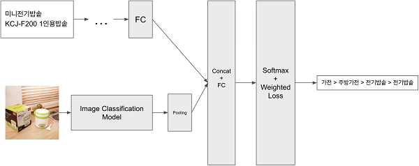
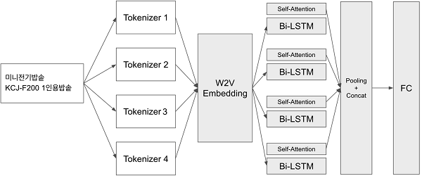

# HW#1

## **SVM(서포트 벡터 머신)이 활용되고 있는 분야 및 사례 조사**

- SVM: 기계 학습 분야 중 하나로 패턴 인식, 자료 분석을 위한 지도 학습에 한 분야이며 주로 분류와 회귀 분석을 위해 사용한다.

---

## 1. **텍스트 및 이미지 분류 (자연어 처리 및 이미지 분석)**

SVM은 새로운 텍스트 데이터에 대한 분류 작업에서도 뛰어난 일반화 능력을 가진다
SVM은 텍스트 데이터를 효과적으로 다루기 위해 텍스트를 수치화하는 과정이 중요하다.
일반적으로 TF-IDF와 같은 방법을 사용하여 단어의 중요성을 나타내는 벡터로 텍스트를 표현한다.
또한 SVM은 이미지 분류에서도 일반화 능력을 가지며, 학습된 모델은 새로운 이미지에 대한 분류를 정확하게 수행할 수 있다.
이미지 분류에서 SVM은 이미지 데이터를 고차원 벡터로 변환하는 데 사용된다.
이미지의 특징을 추출하여 벡터로 표현하며, 이를 위해 HOG, SIFT, 또는 CNN 특징과 같은 방법을 활용할 수 있다.

**<사례: 홈쇼핑모아 by 버즈니>**

 버즈니가 운영 중인 모바일 홈쇼핑 포털 앱 ‘홈쇼핑모아’에는 1억 개 이상의 상품이 존재한다. 이 1억개 이상의 상품을 아우를 수  있는 별도의 통합된 카테고리 체계가 필요하며, 다시 분류할 필요성이 생긴다. 버즈니에서는 이를 위해 딥러닝 기술을 활용하여 자동으로 상품의 카테고리를 분류하는 시스템을 구축했다.

 머신러닝 기술을 활용하여 상품 카테고리를 분류하기 위해 트레이닝 데이터셋 구축이 필요하다. 이를 위해 다양한 전처리 방법과 파트타이머를 활용한 데이터셋을 구축했다. 카테고리 분류에는 상품명을 기반으로 텍스트 정보와, 상품 이미지에서 추출한 이미지 정보를 사용했다.

딥러닝을 활용한 자연어처리 모델에 대한 연구가 진행되기 전에는 SVM을 초기 모델로 활용하여 카테고리 분류를 수행했다. 텍스트 정보는 버즈니에서 자체 개발한 쇼핑 데이터에 최적화된 상품명 토크나이저**¹**를 포함, 공개된 여러 토크나이저**¹**를 이용하였다. 이를 활용해 생성된 텍스트 단어들을 TF-IDF**²** 방법을 이용해 벡터화 시킨 후, 벡터화된 상품명 정보를 SVM의 입력으로 하여 카테고리 분류를 수행했다.

 버즈니는 문자 단위의 CNN과 RNN계열의 딥러닝 모델 등장 이후 텍스트 정보 추출 과정을 Bidirectional LSTM과 Self-attention 기법을 활용한 모델로 교체하였다.

Bidirectional LSTM과 Self-Attention을 이용한 텍스트 정보 추출 모델

이미지 데이터는 카테고리 데이터셋을 이용하여 이미지 분류 모델을 학습시킨 후, 해당 모델에서 추출된 이미진 피쳐를 활용하였다. 초기 이미지 분류 모델 중 하나인 VGG 부터 최신 모델까지 다양한 연구를 진행한 후 최적의 모델을 학습하여 사용했다. 최종적으로 텍스트 모델에서 생성된 텍스트 정보와, 이미지 모델에서 추출된 이미지 피쳐를 결합하여 카테고리 분류기를 학습했다.

텍스트 정보와 이미지 정보를 결합한 최종 분류 모델

1) 토크나이저(Tokenizer) - 입력된 텍스트를 모델에서 처리할 수 있는 데이터로 변환하는 것이 목적으로, 모델은 숫자만 처리할 수 있으므로 토크나이저는 텍스트 입력을 숫자 데이터로 변환한다.

2) TF-IDF - 정보 검색과 텍스트 마이닝에서 이용하는 가중치로, 여러 문서로 이루어진 문서군이 있을 때 어떤 단어가 특정 문서 내에서 얼마나 중요한 것인지 나타내는 통계적 수치이다. 문서의 핵심어를 추출하거나, 검색 엔진에서 검색 결과의 순위를 결정 하거나, 문서들 사이의 비슷한 정도를 구하는 등의 용도로 사용할 수 있다.

출처 : [IT DAILY [기고] 홈쇼핑모아의 상품 카테고리 자동 분류 시스템](http://www.itdaily.kr/news/articleView.html?idxno=102162)

---

## 2. **생물 정보학 - 유전자 발현 데이터 분석**

SVM은 유전자 발현 데이터를 기반으로 유용한 정보를 추출하고, 질병의 발생 가능성 예측 또는 단백질 구조 예측과 같은 생물 정보학 분야에서 활용된다.

**<사례: 당뇨병 진단>**
SVM을 활용한 당뇨병 진단은 개별 환자의 유전자 발현 데이터를 분석하여 당뇨병 여부를 예측한다.
조기 진단 및 개인 맞춤형 치료 계획을 수립하는 데 도움이 된다.
환자 집단과 정상 집단에서 수많은 유전자 발현 데이터를 수집한다. 이 데이터에는 수많은 유전자의 발현 수준 정보가 포함된다.
SVM은 모든 유전자를 사용하지 않고 중요한 유전자를 선택하여 고차원 데이터를 줄인다. 이로써 SVM 모델의 효율성과 정확도를 향상시킨다.
선택된 유전자의 발현 데이터는 벡터 형태로 표현된다. 이 벡터는 각 환자를 나타내는 특징 벡터로 사용된다.
환자 데이터는 당뇨병 환자와 정상 환자로 라벨링된다. 이진 분류 문제로 각 환자에 대한 당뇨병 여부를 표시한다.
SVM 알고리즘은 학습 데이터를 사용하여 당뇨병 환자와 정상 환자를 분류하는 초평면(Decision Boundary)을 찾는다.
이 결정 경계는 최적 분리를 위해 조정된다. 학습된 SVM 모델은 새로운 환자의 발현 데이터를 입력으로 받아 환자가 당뇨병 환자인지 예측할 수 있다.

---

## 3. **환경 모니터링**

SVM은 대기 중의 다양한 오염 물질을 분류하고 수준을 예측하여 환경 단체가 오염 관련 문제에 대한 조치를 취하고 대기 질을 개선하는 데 도움을 준다.

**<사례: 대기 오염 모니터링>**
대기 중 오염 물질과 기상 조건 데이터를 수집한다.이 데이터에는 화학 물질 농도, 온도, 습도 등이 포함됩니다.
수집한 데이터는 정규화하고 이상치를 처리하여 데이터의 신뢰성을 높인다.
다양한 대기 조건 및 오염 물질 농도와 관련된 특징을 추출한다. (예를 들어, 미세먼지 농도, 이산화질소 농도 등이 추출됨)
오염 수준에 따라 데이터를 분류하고 라벨링한다. 공기 질이 좋음, 보통, 나쁨 등으로 분류될 수 있다.
SVM 모델을 학습시켜 대기 오염 수준을 예측하는 모델을 생성한다.
학습된 SVM 모델은 실시간으로 대기 오염을 모니터링하고, 오염 수준이 위험 수준에 도달하면 경보를 발생시킨다.

---

## 4.로보틱스

SVM은 로봇이 주변 환경을 인식하고 작업을 수행하는 데에 활용된다.
자율 주행 차량과 로봇 비전 시스템은 이러한 기술을 통해 더 안전하고 효율적으로 작동할 수 있다.

**<사례: 자율 주행 자동차>**
SVM은 자율 주행 차량에서 활용되며, 차량 주변의 도로 및 객체를 감지하고 분류하는 데 사용된다.
차량은 카메라 및 센서를 통해 수집한 데이터를 SVM 모델에 입력으로 제공하여 도로 상황을 이해하고 주행 결정을 내린다.

---

## 5. 패턴 인식

SVM은 패턴 인식 분야에서 중요한 역할을 한다.
패턴 인식은 손글씨 인식, 얼굴 인식, 지문 인식 및 음성 인식과 같은 다양한 작업을 포함한다.
이를 통해 기계는 복잡한 패턴을 학습하고 인식할 수 있으며, 음성 인식 및 생체 인식 분야에서 보안 및 사용자 경험을 향상시키는 데 기여한다.

**<사례: 지문 인식 시스템>**
사용자의 지문 패턴은 이미지로 획득되며, SVM 모델은 이러한 이미지를 분석하여 지문을 인식하고 개인 식별에 사용된다.
